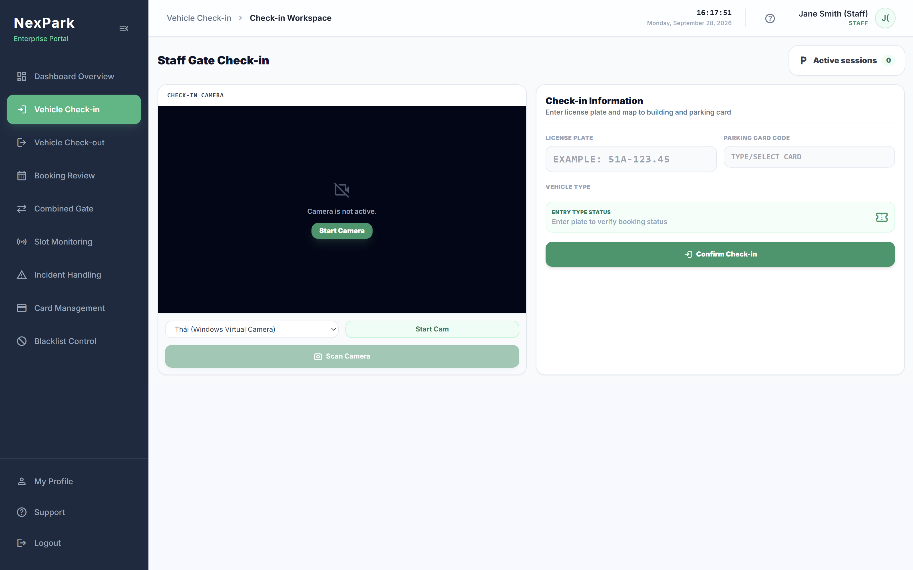
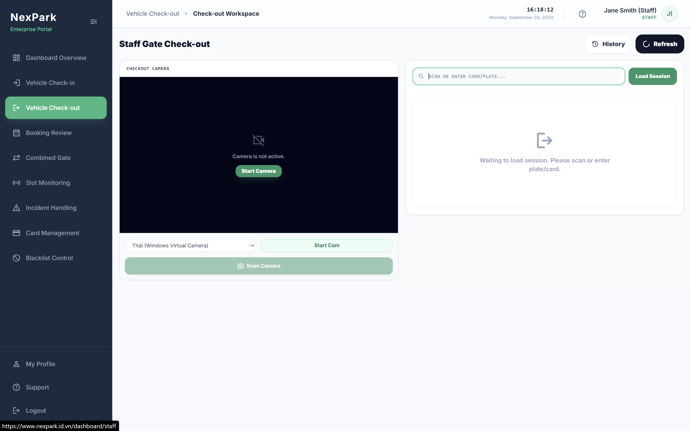
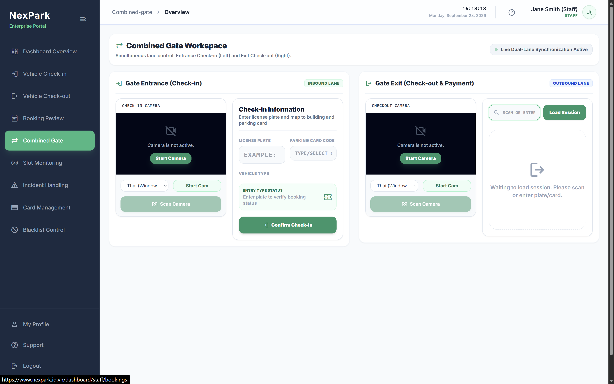
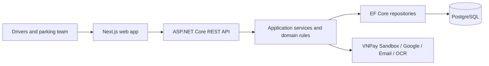
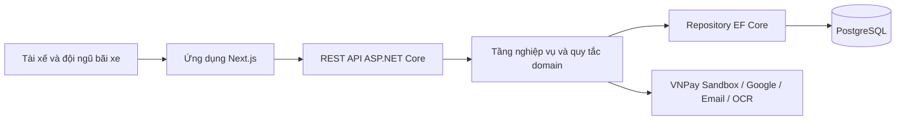

# NexPark (PBMS)

[English](#english) - [Tiếng Việt](#tiếng-việt)

### Gate workspaces / Giao diện cổng xe

| Check-in / Xe vào | Check-out / Xe ra | Combined gate / Cổng kết hợp |
|---|---|---|
| [](./Check-inPage.png) |  |  |

*The screenshots show the workspaces before a camera or parking session is active. / Ảnh chụp giao diện ở trạng thái chờ, trước khi bật camera hoặc tải phiên gửi xe.*

---

## English

**A parking management web application for drivers and building operators**

[Visit the public website](https://www.nexpark.id.vn/)  **Public source code:** [Parking-Management-Team on GitHub](https://github.com/Parking-Management-Team)

**Project status:** Public website online; academic project with operational demo workflows.

NexPark is the web interface for the Parking Building Management System (PBMS). It connects advance parking reservations with day-to-day gate operations, space management, pricing, and reporting. Drivers can manage vehicles and bookings, while staff, managers, and administrators use role-specific workspaces to run the parking facility.

> The public website presents the project. The gate screenshots above show staff workspaces; they do not demonstrate a completed transaction or a connection to a physical barrier.

### Project at a glance

| | |
|---|---|
| **Product** | Driver portal and role-based parking operations workspaces |
| **My contribution** | Led the backend check-in/check-out flow; drafted project documentation and feature/solution proposals with team input; supported other flows and built basic demo UI |
| **Frontend** | Next.js App Router, React, TypeScript, Tailwind CSS |
| **Backend** | ASP.NET Core (.NET 10), C#, REST APIs, Entity Framework Core |
| **Data** | PostgreSQL; EF Core migrations |
| **Integrations** | VNPay Sandbox, Google sign-in, email OTP, license plate OCR via Plate Recognizer |
| **Development and checks** | Docker Compose, GitHub Actions CI, unit tests |

### What the application does

| Area | Capabilities |
|---|---|
| **Drivers** | Register or sign in, manage vehicles, view parking information, make and manage advance bookings, and review sessions and payments. |
| **Gate staff** | Check vehicles in and out, look up bookings, assign parking spaces, manage cards, and record incidents such as lost cards. Camera/OCR can assist with plate entry; manual entry remains available. |
| **Managers and administrators** | Manage buildings, floors, zones, spaces, vehicle types, pricing policies, accounts, blacklists, and system settings; view operational and revenue dashboards. |
| **Core rules** | Check capacity and booking conflicts, track space occupancy, calculate parking fees, apply configured grace periods and penalties, and process cash or VNPay Sandbox payments. |

Monthly subscriptions have partial data and code support but are **not a complete end-to-end user flow**. Physical barrier control is outside the implemented demo. Authorization coverage and some frontend–backend contracts still need work before production use.

### My work

- Took primary responsibility for the vehicle check-in/check-out backend flow: the API and service logic that records entry, manages an active parking session, and processes exit.
- Connected that flow to related booking, vehicle, parking-space, card, and payment data so the gate workflow could be demonstrated end to end.
- Wrote project documentation, proposed features and solution approaches, and refined them through discussion with the team. The resulting decisions were collaborative.
- Helped with other backend flows and built basic Next.js screens and API connections to exercise the backend during demos.

### Architecture



The frontend groups screens by feature and calls the API through a shared client. The backend separates HTTP controllers, application services, domain logic, and infrastructure. PostgreSQL stores bookings, sessions, payments, parking spaces, and related records. Background workers handle time-based tasks such as expired bookings.

### Delivery workflow

The repositories include Dockerfiles and a Docker Compose setup for running the web app and API together. GitHub Actions workflows are configured to build both applications, check the frontend, and run backend unit tests. The public website is available at the link above; an automated production deployment workflow is not established in the repository.

```text
Code change -> GitHub Actions checks -> local/container demo
```

### Source and visibility

The web and API repositories are public under the [Parking-Management-Team GitHub organization](https://github.com/Parking-Management-Team). The website and the three gate-workspace screenshots can also be viewed directly. The feature list reflects the implementation examined for this case study, with incomplete flows called out explicitly.

---

## Tiếng Việt

**Ứng dụng web quản lý bãi đỗ xe cho tài xế và đội ngũ vận hành tòa nhà**

[Truy cập website công khai](https://www.nexpark.id.vn/)  **Mã nguồn công khai:** [Parking-Management-Team trên GitHub](https://github.com/Parking-Management-Team)

**Trạng thái dự án:** Website công khai đang hoạt động; dự án học thuật có các luồng vận hành để demo.

NexPark là giao diện web của Parking Building Management System (PBMS). Hệ thống kết nối việc đặt chỗ trước với vận hành xe ra/vào, quản lý vị trí đỗ, tính phí và báo cáo. Tài xế có thể quản lý phương tiện và lượt đặt chỗ; nhân viên, quản lý và quản trị viên sử dụng các trang làm việc theo vai trò để vận hành bãi xe.

> Website công khai giới thiệu dự án. Ba ảnh giao diện cổng xe ở đầu tài liệu chỉ cho thấy các trang dành cho nhân viên; chúng không chứng minh một giao dịch đã hoàn tất hoặc đã kết nối barie vật lý.

### Tổng quan dự án

| | |
|---|---|
| **Sản phẩm** | Cổng dành cho tài xế và các trang vận hành bãi xe theo vai trò |
| **Đóng góp của tôi** | Phụ trách chính backend luồng check-in/check-out; viết tài liệu, đề xuất feature và hướng giải quyết có thảo luận cùng nhóm; hỗ trợ các luồng khác và làm UI demo cơ bản |
| **Frontend** | Next.js App Router, React, TypeScript, Tailwind CSS |
| **Backend** | ASP.NET Core (.NET 10), C#, REST API, Entity Framework Core |
| **Dữ liệu** | PostgreSQL; EF Core migrations |
| **Tích hợp** | VNPay Sandbox, đăng nhập Google, email OTP, nhận diện biển số qua Plate Recognizer |
| **Phát triển và kiểm tra** | Docker Compose, GitHub Actions CI, unit test |

### Hệ thống hỗ trợ những gì

| Nhóm chức năng | Khả năng |
|---|---|
| **Tài xế** | Đăng ký hoặc đăng nhập, quản lý phương tiện, xem thông tin bãi đỗ, tạo và quản lý lượt đặt chỗ, xem phiên gửi xe và thanh toán. |
| **Nhân viên cổng** | Check-in/check-out, tra cứu booking, phân bổ chỗ đỗ, quản lý thẻ và ghi nhận sự cố như mất thẻ. Camera/OCR hỗ trợ nhập biển số; vẫn có thể nhập thủ công. |
| **Quản lý và quản trị** | Quản lý tòa nhà, tầng, khu vực, vị trí đỗ, loại xe, chính sách giá, tài khoản, danh sách đen và cấu hình; theo dõi dashboard vận hành và doanh thu. |
| **Quy tắc cốt lõi** | Kiểm tra sức chứa và trùng lịch đặt chỗ, theo dõi trạng thái vị trí đỗ, tính phí, áp dụng thời gian ân hạn và tiền phạt, xử lý thanh toán tiền mặt hoặc VNPay Sandbox. |

Vé tháng mới có một phần cấu trúc dữ liệu và mã nguồn, **chưa phải luồng người dùng hoàn chỉnh từ đầu đến cuối**. Bản demo chưa điều khiển barie vật lý. Một số API vẫn cần hoàn thiện phân quyền và đồng bộ hợp đồng với frontend trước khi dùng trong production.

### Công việc tôi thực hiện

- Phụ trách chính backend của luồng xe vào/ra: API và tầng nghiệp vụ ghi nhận check-in, quản lý phiên gửi xe đang hoạt động và xử lý check-out.
- Kết nối luồng này với dữ liệu booking, phương tiện, vị trí đỗ, thẻ và thanh toán để trình diễn quy trình tại cổng từ đầu đến cuối.
- Viết tài liệu dự án, đề xuất feature và hướng giải quyết, sau đó hoàn thiện qua thảo luận với các thành viên. Các quyết định cuối cùng là kết quả làm việc chung của nhóm.
- Hỗ trợ những luồng backend khác và làm các màn hình Next.js, kết nối API ở mức cơ bản để kiểm tra và demo backend.

### Kiến trúc



Frontend tổ chức màn hình theo tính năng và gọi API qua một client dùng chung. Backend tách controller HTTP, tầng ứng dụng, logic domain và tầng hạ tầng. PostgreSQL lưu booking, phiên gửi xe, thanh toán, vị trí đỗ và dữ liệu liên quan. Các tác vụ nền xử lý những việc theo thời gian như booking hết hạn.

### Quy trình phát triển và kiểm tra

Hai codebase có Dockerfile và cấu hình Docker Compose để chạy web cùng API. GitHub Actions được cấu hình để build hai ứng dụng, kiểm tra frontend và chạy unit test backend. Website công khai có tại liên kết ở đầu phần này; repository chưa thiết lập quy trình tự động triển khai production.

```text
Thay đổi mã -> GitHub Actions kiểm tra -> Demo local/container
```

### Mã nguồn và phạm vi chia sẻ

Hai repository web và API đều công khai trong [tổ chức GitHub Parking-Management-Team](https://github.com/Parking-Management-Team). Có thể truy cập website và xem trực tiếp ba ảnh giao diện cổng xe. Các chức năng trên được đối chiếu với mã nguồn; những luồng chưa hoàn chỉnh đã được ghi rõ.
