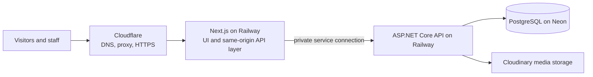
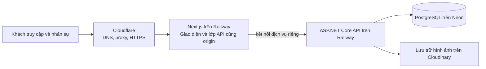

# VinFastHappy

[English](#english) - [Tiếng Việt](#tiếng-việt)

---

## English

**Commercial website and internal operations platform for a VinFast electric vehicle business**

[Visit the public website](https://vinfasthappy.com) · **Source code:** Private commercial repository

VinFastHappy brings the customer-facing catalog and the team's daily operations into one application. Visitors can explore vehicles, read news, find branches, and request advice. Authorized staff use dedicated workspaces to manage the information behind those experiences.

> This case study describes the system without publishing source code, customer records, business data, credentials, or internal workspace screenshots.

### Project at a glance

| | |
|---|---|
| **Product** | Public website with role-based internal workspaces |
| **My contribution** | Full-stack development across UI, APIs, data modeling, authentication, and deployment |
| **Frontend** | Next.js App Router, React, TypeScript, Tailwind CSS |
| **Backend** | ASP.NET Core, Entity Framework Core, REST APIs |
| **Data and media** | PostgreSQL on Neon, Cloudinary |
| **Delivery** | Cloudflare, Railway, GitHub Actions |

### What the application does

| Area | Capabilities |
|---|---|
| **Public experience** | Vehicle catalog and product details, news, branch information, and contact requests. |
| **Content and catalog** | Staff workflows for products, categories, website content, and images. |
| **Operations** | Branch and staff management, internal announcements, and administrative views for customer requests and orders. |
| **Access control** | Staff authentication, role-based permissions, scoped access to data, password recovery, and audit history. |

The codebase also contains customer accounts, checkout, and service booking flows. These are controlled by release flags and are **not part of the public production experience** described here. Newer content and shared media workflows are under development and should not be read as already deployed.

### My work

- Built responsive public pages and role-specific workspaces with Next.js, React, and TypeScript.
- Developed ASP.NET Core endpoints and application services for catalog, content, branches, customer requests, and administration.
- Modeled relational data with Entity Framework Core and PostgreSQL, including migrations for evolving features.
- Implemented staff authentication, permission checks, password recovery, and audit visibility.
- Integrated Cloudinary for media and set up the delivery path across CI, staging, and production.

### Architecture



The browser uses the Next.js application for both pages and `/api/*` requests. Next.js forwards API traffic to a private ASP.NET Core service. Business data lives in PostgreSQL; uploaded media lives in Cloudinary.

### Delivery workflow

GitHub Actions runs CI and deploys a verified revision to staging. Production deployment uses a version tag and requires the staging verification for the same revision. Database migrations and health checks are part of the deployment workflow; a GitHub Release follows production acceptance.

```text
Code change → CI → Staging verification → Version tag
            → Production migration and deployment → Health checks → Release
```

### Source and visibility

The repository is private because this is a commercial application. The public website is linked above; internal screens and business data are intentionally excluded from this case study. This document reflects the implemented architecture and distinguishes released features from work still in development.

---

## Tiếng Việt

**Website thương mại và nền tảng vận hành nội bộ cho một doanh nghiệp kinh doanh xe điện VinFast**

[Truy cập website công khai](https://vinfasthappy.com) · **Mã nguồn:** Repository thương mại riêng tư

VinFastHappy kết nối website giới thiệu sản phẩm với công việc vận hành hằng ngày của đội ngũ. Khách truy cập có thể xem các dòng xe, đọc tin tức, tìm cửa hàng và gửi yêu cầu tư vấn. Nhân sự được cấp quyền sử dụng các trang quản trị để cập nhật thông tin phục vụ những trải nghiệm đó.

> Tài liệu này giới thiệu hệ thống mà không công bố mã nguồn, thông tin khách hàng, dữ liệu kinh doanh, thông tin truy cập hoặc ảnh chụp giao diện nội bộ.

### Tổng quan dự án

| | |
|---|---|
| **Sản phẩm** | Website công khai và các trang quản trị theo vai trò |
| **Đóng góp của tôi** | Phát triển toàn hệ thống: giao diện, API, mô hình dữ liệu, xác thực và triển khai |
| **Frontend** | Next.js App Router, React, TypeScript, Tailwind CSS |
| **Backend** | ASP.NET Core, Entity Framework Core, REST API |
| **Dữ liệu và hình ảnh** | PostgreSQL trên Neon, Cloudinary |
| **Hạ tầng và phát hành** | Cloudflare, Railway, GitHub Actions |

### Hệ thống hỗ trợ những gì

| Nhóm chức năng | Khả năng |
|---|---|
| **Website công khai** | Danh mục và chi tiết xe, tin tức, thông tin cửa hàng và yêu cầu liên hệ. |
| **Nội dung và sản phẩm** | Quy trình quản lý sản phẩm, danh mục, nội dung website và hình ảnh cho nhân sự. |
| **Vận hành** | Quản lý cửa hàng và nhân sự, thông báo nội bộ, các trang quản trị yêu cầu khách hàng và đơn hàng. |
| **Kiểm soát truy cập** | Đăng nhập nhân sự, phân quyền theo vai trò, giới hạn phạm vi dữ liệu, khôi phục mật khẩu và lịch sử thao tác. |

Mã nguồn cũng có luồng tài khoản khách hàng, thanh toán và đặt lịch dịch vụ. Các luồng này được kiểm soát bằng cờ phát hành và **chưa thuộc trải nghiệm production công khai** được mô tả ở đây. Những quy trình mới về nội dung và thư viện Media dùng chung đang được phát triển, chưa được xem là đã triển khai.

### Công việc tôi thực hiện

- Xây dựng các trang công khai đáp ứng nhiều kích thước màn hình và trang làm việc theo vai trò bằng Next.js, React và TypeScript.
- Phát triển API và tầng nghiệp vụ ASP.NET Core cho sản phẩm, nội dung, cửa hàng, yêu cầu khách hàng và quản trị.
- Thiết kế dữ liệu quan hệ bằng Entity Framework Core và PostgreSQL, bao gồm migration khi tính năng thay đổi.
- Triển khai xác thực nhân sự, kiểm tra quyền, khôi phục mật khẩu và khả năng theo dõi lịch sử thao tác.
- Tích hợp Cloudinary để lưu trữ hình ảnh và thiết lập quy trình từ CI qua staging đến production.

### Kiến trúc



Trình duyệt truy cập trang và gửi yêu cầu `/api/*` qua ứng dụng Next.js. Next.js chuyển tiếp yêu cầu API đến dịch vụ ASP.NET Core trong mạng riêng. Dữ liệu nghiệp vụ được lưu trên PostgreSQL; hình ảnh tải lên được lưu trên Cloudinary.

### Quy trình phát hành

GitHub Actions chạy CI và triển khai bản mã đã xác minh lên staging. Bản production được triển khai từ version tag và phải có kết quả xác minh staging của cùng phiên bản mã. Quy trình triển khai bao gồm migration cơ sở dữ liệu và kiểm tra tình trạng dịch vụ; GitHub Release được tạo sau khi nghiệm thu production.

```text
Thay đổi mã → CI → Xác minh staging → Version tag
            → Migration và triển khai production → Kiểm tra dịch vụ → Release
```

### Mã nguồn và phạm vi chia sẻ

Repository được giữ riêng tư vì đây là dự án thương mại. Website công khai được liên kết ở đầu phần này; ảnh chụp trang nội bộ và dữ liệu kinh doanh không xuất hiện trong tài liệu. Nội dung giới thiệu phản ánh kiến trúc đã xây dựng và phân biệt tính năng đã phát hành với phần đang phát triển.
